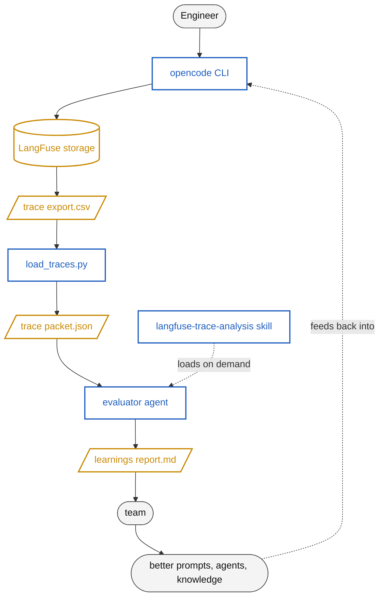

# SDx Evaluation Agent — System Explained

This document explains the evaluation agent in simple language.
It is written for readers who are new to the system, including
non-native English speakers. Sentences are short on purpose.

---

## 1. What this system is

The SDx evaluation agent reads logs of past conversations
between engineers and AI agents. It writes a short report
about what happened in each conversation. The report helps
the team improve the agents, the prompts, and the workflow.

It is one report per conversation. The report is a Markdown
file. We save it in the `eval-reports/` folder.

---

## 2. Why we built it

The SDx flow has many AI agents. Engineers use them every day.
We need to know:

- Are the agents helpful?
- Where do they make mistakes?
- What do users have to repeat or correct?
- What can we improve?

Looking at log files by hand is slow. The evaluation agent
reads the logs for us and writes a clear report.

The team agreed on May 5, 2026 that the first version should
be small. It should only:

1. Read the LangFuse log file.
2. Pick one conversation.
3. Write a Markdown report.
4. Save the report to a folder.

That is the version this document describes.

---

## 3. How the data flows

The system has three stages: **capture**, **evaluate**, **improve**.
Each box is one piece of the system or one piece of data. Arrows show
the direction of flow.

In all diagrams below:

- **System** components (the agent, the skill, the script, opencode)
  are shown in **blue**.
- **Data** (the CSV, the packet, the report) is shown in **amber**.
- **Actors** (the engineer, the team) are shown in **gray**.

### ASCII version

```
                            ┌─────────────┐
              1 · CAPTURE   │  Engineer   │  actor
                            └──────┬──────┘
                                   ▼
                            ┌─────────────┐
                            │  opencode   │  system
                            └──────┬──────┘
                                   ▼
                            ┌─────────────┐
                            │  LangFuse   │  data store
                            └──────┬──────┘
                                   ▼
                       ┌────────────────────┐
                       │  trace export.csv  │  data
                       └──────────┬─────────┘
                                  ▼
              2 · EVALUATE  ┌──────────────────┐
                            │  load_traces.py  │  system
                            └────────┬─────────┘
                                     ▼
                          ┌─────────────────────┐
                          │  trace packet.json  │  data
                          └──────────┬──────────┘
                                     ▼
                          ┌──────────────────┐    ┌──────────────────────────┐
                          │  evaluator agent │ ◄──│ langfuse-trace-analysis  │  system
                          │   (primary)      │    │       SKILL.md           │
                          └─────────┬────────┘    └──────────────────────────┘
                                    ▼            (loaded on demand)
                          ┌────────────────────┐
                          │  learnings .md     │  data
                          └─────────┬──────────┘
                                    ▼
              3 · IMPROVE   ┌─────────────────┐
                            │  team review    │  actor
                            └────────┬────────┘
                                     ▼
                  ┌──────────────────────────────────────┐
                  │  better prompts · agents · knowledge │
                  └──────────────────────────────────────┘
                                    │
                                    └─── feeds back into opencode
```

### Mermaid version

For viewers that render Mermaid (GitHub, VS Code, most modern Markdown
tools), this is the same diagram in code form so it can be edited:



### What each stage does

| Stage | What happens | Output |
|---|---|---|
| **1. Capture** | Engineer works in opencode. Every model call is logged to LangFuse. | A trace export (CSV). |
| **2. Evaluate** | The loader filters and groups the export. The evaluator agent reads one session's packet, loads the skill, and writes a report. | A learnings report (`.md`). |
| **3. Improve** | The team reads the report and changes prompts, agents, or the knowledge layer. Those changes feed back into the next opencode session. | A better SDx flow. |

---

## 4. The pieces

There are five pieces. Each one has a single job.

### 4.1 The LangFuse export (`*.csv`)

This is the raw log. LangFuse records every call from
opencode to the language model. The file has 15 columns
and can be very large (over 100 MB).

We do not change this file. We only read it.

### 4.2 The trace loader (`scripts/load_traces.py`)

A small Python script. It does three things:

1. Opens the big CSV file safely.
2. Keeps only the rows that have real conversation
   content. (LangFuse stores two kinds of rows; only one
   kind contains user messages and agent answers.)
3. Groups the rows by **session**. One session is one
   conversation between one user and the agent.

The output is a JSON file. We call it a **trace packet**.
A typical packet is about 70 KB. That is small enough for
the language model to read all of it.

You run the loader from the command line:

```bash
# See all sessions in the file
python scripts/load_traces.py --csv export.csv --list

# Build a packet for one session
python scripts/load_traces.py --csv export.csv --session ses_XYZ > packet.json
```

### 4.3 The skill (`.opencode/skills/langfuse-trace-analysis/SKILL.md`)

A skill is a piece of teaching material. The agent loads
it on demand when it needs to know how to do a task.

This skill teaches the agent:

- What columns are in a trace packet.
- Which rows to look at and which to ignore.
- What signals to count.
- What sections the report must have.

By keeping this knowledge in a skill, we can update the
rules without changing the agent itself.

### 4.4 The agent (`.opencode/agent/evaluator.md`)

This is the evaluation agent. It is a Markdown file with
a small YAML header. opencode reads the file and creates
the agent from it.

The agent does these steps every time it runs:

1. Load the skill (above).
2. Run the loader script.
3. Read the trace packet JSON.
4. Count signals.
5. Look for patterns (corrections, retries, abandoned tasks).
6. Write a report file in `eval-reports/`.

The agent always works on **one session at a time**. If
the user asks for many sessions, it does them one by one.

### 4.5 The report (`eval-reports/<session_id>_<timestamp>_learnings.md`)

The full file name follows this pattern:

```
<session_id>_<YYYYMMDDTHHMMSSZ>_learnings.md
```

For example:
`ses_synthetic_camera_obj_det_001_20260509T140500Z_learnings.md`

The timestamp is in UTC. Putting it in the file name means the same
session can be re-evaluated later (after the agent or prompts change)
without overwriting older reports. All reports for one session sort
together in a directory listing.

The output. It has six sections:

1. **Summary** — one paragraph. What the user wanted and what they got.
2. **Structural signals** — numbers. Turn count, tool calls, tokens, finish reasons.
3. **Qualitative observations** — short notes about what happened. Each note cites a trace ID.
4. **Implicit signals** — patterns from the FLAME-style research direction.
5. **Recommendations** — concrete changes the team should make.
6. **Appendix** — paths to the raw data.

Reports are short. Less than 600 lines.

---

## 5. The kinds of signals we look for

We use three kinds of signals. Each gives different evidence.

| Kind | What it is | How we get it |
|---|---|---|
| **Structural** | Numbers from the data | We count |
| **Qualitative** | Human-style observations | The model reads and judges |
| **Implicit** | Hidden signals in user behavior | The model pattern-matches |

The implicit signals are the new direction. They come from
the FLAME research line on agent evaluation. The idea is
that real users already give us feedback for free, just by
how they behave. We do not need to ask them to score the
agent.

Examples of implicit signals:

- The user repeats a question. The first answer was probably wrong.
- The user says "no" or "actually" or "wait". The agent did the wrong thing.
- The user goes silent for a long time. The session may be abandoned.
- The agent calls the same tool again with a smaller query. It is retrying.
- The agent's text mentions an error from a previous tool call. The tool is broken.

---

## 6. How to run the system

### 6.1 First, install opencode

The agent runs inside opencode. See `https://opencode.ai`
for install steps. The team is on opencode 1.4.0.

### 6.2 Open this folder in opencode

```bash
cd /path/to/eval-agent
opencode
```

opencode will read `opencode.json` and find the
`evaluator` agent.

### 6.3 Switch to the evaluator agent

In opencode, press `Tab` to open the agent picker. Select
`evaluator`.

### 6.4 Tell the agent what to do

Example messages, using the included synthetic toy session:

> "Evaluate session `ses_synthetic_camera_obj_det_001`
> in `data/synthetic-traces.csv`."

> "List the sessions in `data/synthetic-traces.csv`. I will pick one."

The agent will:

1. Run the loader script.
2. Read the packet.
3. Write a report to `eval-reports/`.
4. Tell you the file path.

### 6.5 Read and use the report

Open the report in any Markdown viewer. Share it with the
team. Use the **Recommendations** section to plan changes.

A worked example is checked into the repo at
`eval-reports/ses_synthetic_camera_obj_det_001_20260509T140500Z_learnings.md`.
It was produced from the synthetic toy session described below.

---

## 6a. The toy session, walked through

The repo ships with a synthetic dataset so anyone can run
the system end-to-end without needing real LangFuse data.

The toy task: *"Add YOLO object detection to the rear
camera module."*

The eight turns are:

1. Agent searches the code graph for the camera module.
2. Agent searches the documentation for object-detection patterns.
3. Agent proposes a plan using YOLOv8.
4. **Engineer corrects:** *"no, use YOLO11."*
5. Agent attempts to write the new file. **Permission denied.**
6. **Agent retries** through a different write path. Succeeds.
7. Agent runs the test suite.
8. Agent confirms tests pass and FDA/ASPICE reports are queued.

Steps 4, 5, and 6 are the three signals the eval agent is
designed to surface:

- step 4 → **user correction**
- step 5 → **tool failure echo**
- steps 5→6 → **retry**

Regenerate or modify the toy data with:

```bash
python scripts/generate_synthetic_traces.py --out data/synthetic-traces.csv
```

---

## 7. What this system is not

We want to be clear about scope.

- It is not a benchmark. We do not give the agent a score.
- It is not a real-time monitor. It runs on past data.
- It is not yet a cross-session summary. One session per report.
- It is not a replacement for FDA or ASPICE reports. It is
  a new report that lives next to them.

These limits are intentional for the first version.
Later versions can extend the system.

---

## 8. What we want to add later

The team has a list of future ideas. Not in scope for
this version, but they shape the design:

- Pull traces directly from the LangFuse API
  (no CSV file step).
- Roll up many sessions into one trend report.
- Add the user-correction-detection paper from CMU as a
  formal signal extractor.
- Feed the report findings back into agent prompts
  automatically.
- Try Laminar as a possible alternative to LangFuse.

These ideas come from the May 5, 2026 team discussion
and from the FLAME research line.

---

## 9. Files in this repository

```
eval-agent/
├── ACTION_LOG.md                 # running log of decisions and progress
├── opencode.json                 # opencode configuration
├── .opencode/
│   ├── agent/
│   │   └── evaluator.md          # the evaluation agent
│   └── skills/
│       └── langfuse-trace-analysis/
│           └── SKILL.md          # trace schema and signals knowledge
├── scripts/
│   ├── load_traces.py            # CSV → JSON packet loader
│   └── generate_synthetic_traces.py   # builds the toy dataset below
├── data/
│   └── synthetic-traces.csv      # 1 toy session, 8 turns, in LangFuse format
├── eval-reports/                 # output folder for reports
│   └── ses_synthetic_camera_obj_det_001_20260509T140500Z_learnings.md   # worked example
├── docs/
│   ├── SYSTEM-EXPLAINED.md       # this file
│   └── slides.md                 # the Marp slide deck
└── SDX Ideas related to evaluation.md  # team alignment doc (input)
```

---

## 10. Glossary

| Term | Meaning |
|---|---|
| **Agent** | A configured AI assistant with a defined role and tools. |
| **Skill** | A reusable instruction file that an agent can load on demand. |
| **Tool** | A function the agent can call (read a file, run a command, etc.). |
| **opencode** | The terminal-based AI coding tool the engineers use. |
| **LangFuse** | The system that records traces of AI calls. |
| **Trace** | One log entry. Usually one model call. |
| **Session** | A group of traces from one user conversation. |
| **Trace packet** | A compact JSON view of one session. Built by our loader. |
| **MCP** | Model Context Protocol. How opencode talks to external tools. |
| **vLLM** | The model server. Runs the open-source models. |
| **FDA / ASPICE** | Other automated reports the team produces, alongside this one. |
| **FLAME** | The research event at CMU where the implicit-signal idea came from. |
